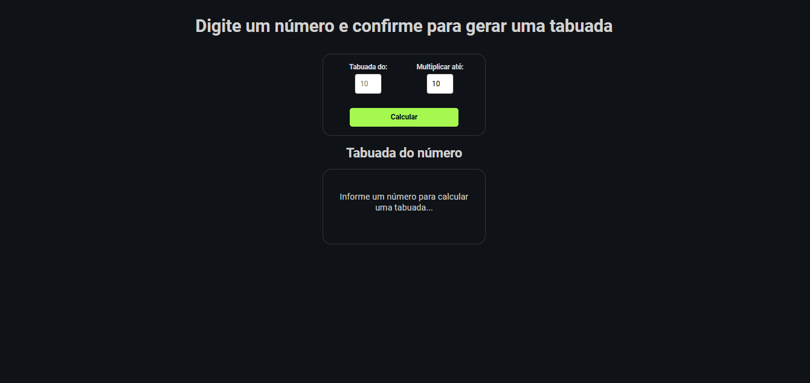
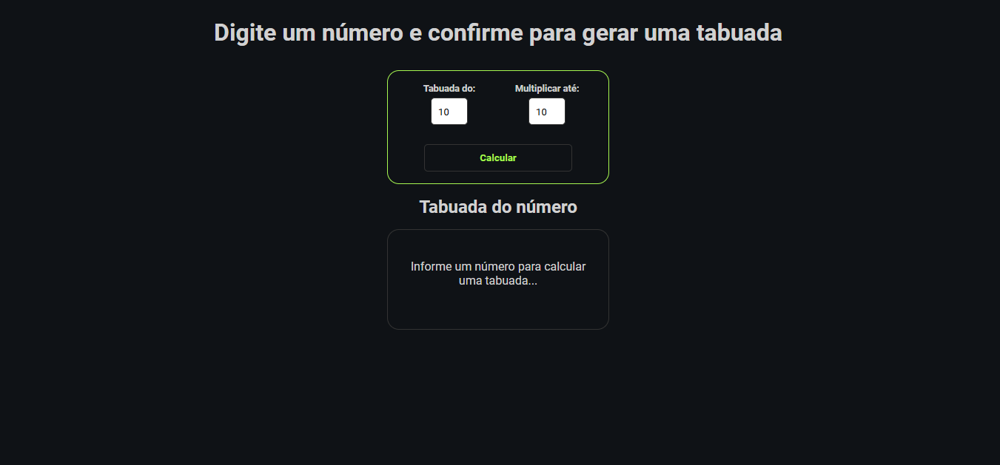

# Projeto de Tabuada em JavaScript

## 🎯 Descrição

Este projeto é uma aplicação simples de tabuada desenvolvida usando HTML, CSS e JavaScript. Ele permite que os usuários insiram um número e um multiplicador, e gera a tabuada correspondente. A interface é interativa e mostra o resultado sem recarregar a página.

## 🚀 Funcionalidades

- 🧮 Entrada de número e multiplicador.
- 📊 Exibição da tabuada no formato de tabela.
- 🔄 Sem recarregamento da página ao enviar o formulário.

## 🛠️ Tecnologias Usadas

- **HTML**: Para estruturação da página.
- **CSS**: Para estilização e layout.
- **JavaScript**: Para lógica e interação.

## 📥 Como Usar

1. **Clone o repositório**

   ```bash
   git clone https://github.com/seu-usuario/projeto-tabuada.git

# 📚 Projeto de Tabuada

## 🎯 Descrição

Este projeto é uma aplicação simples de tabuada desenvolvida usando HTML, CSS e JavaScript. Ele permite que os usuários insiram um número e um multiplicador, e gera a tabuada correspondente. A interface é interativa e mostra o resultado sem recarregar a página.

## 🚀 Funcionalidades

- 🧮 Entrada de número e multiplicador.
- 📊 Exibição da tabuada no formato de tabela.
- 🔄 Sem recarregamento da página ao enviar o formulário.

## 🛠️ Tecnologias Usadas

- **HTML**: Para estruturação da página.
- **CSS**: Para estilização e layout.
- **JavaScript**: Para lógica e interação.

## 📥 Como Usar

1. **Clone o repositório**

   git clone https://github.com/seu-usuario/projeto-tabuada.git

2. **Navegue até o diretório do projeto**

   cd projeto-tabuada

3. **Abra o arquivo index.html no seu navegador**


🔍 Exemplo de Uso
Abra a página em seu navegador.
Insira um número no campo "Número".
Insira um multiplicador no campo "Multiplicador".
Clique no botão "Gerar Tabuada".
A tabuada correspondente será exibida abaixo do formulário.

🖼️ Imagens
Aqui estão algumas capturas de tela da aplicação em funcionamento:





🤝 Contribuição
Sinta-se à vontade para contribuir com o projeto! Para relatar problemas ou sugerir melhorias, abra uma issue ou envie um pull request.

📝 Licença
Este projeto está licenciado sob a Licença MIT.

📬 Contato
Se você tiver dúvidas ou sugestões, entre em contato:

Nome: Pedro Sampaio
E-mail: pedrosampaio11@icloud.com
GitHub: PedroSampaio11
Obrigado por visitar o repositório! 🎉